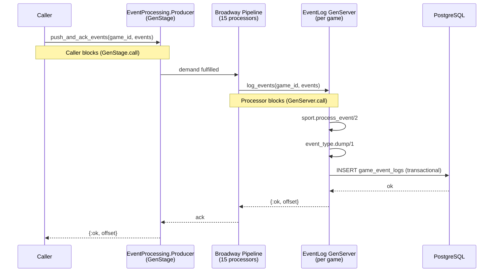

# GameKeeper

GameKeeper is an Elixir/Phoenix backend for ingesting and persisting real-time sports game events. It currently supports basketball, and is designed to be extended to other sports.

Events are written to an append-only log per game, with each entry assigned a monotonically increasing offset. The system is built for high-throughput ingestion with natural backpressure — producers are blocked until their events are durably committed.

## Architecture

Event ingestion is handled by a Broadway pipeline backed by GenStage. Each game has its own `EventLog` GenServer registered in an OTP Registry. Callers block until the pipeline acknowledges their events, ensuring events are persisted before control is returned.



Backpressure is natural: once all 15 processors are occupied with in-flight database writes, Broadway stops pulling from the producer. Per-game GenServers isolate games from one another — a slow game doesn't block others.

## Sports

Sports are pluggable via the `GameKeeper.Sports.Sport` and `GameKeeper.Sports.EventType` behaviours. Each sport defines its event types, how to apply them to game state (`process_event/2`), and how to serialize/deserialize them to the database (`dump/1`, `load/1`).

Currently supported: **basketball** (score events: 1pt, 2pt, 3pt).

## Setup

```bash
mix setup       # install deps, create DB, run migrations
mix phx.server  # start the server (localhost:4000)
```

Or interactively:

```bash
iex -S mix phx.server
```

## Simulating a Game

A basketball simulator is included for development and testing:

```elixir
GameKeeper.Simulators.Basketball.simulate("My Game")
# => {:ok, %{home: 98, away: 91}}
```
